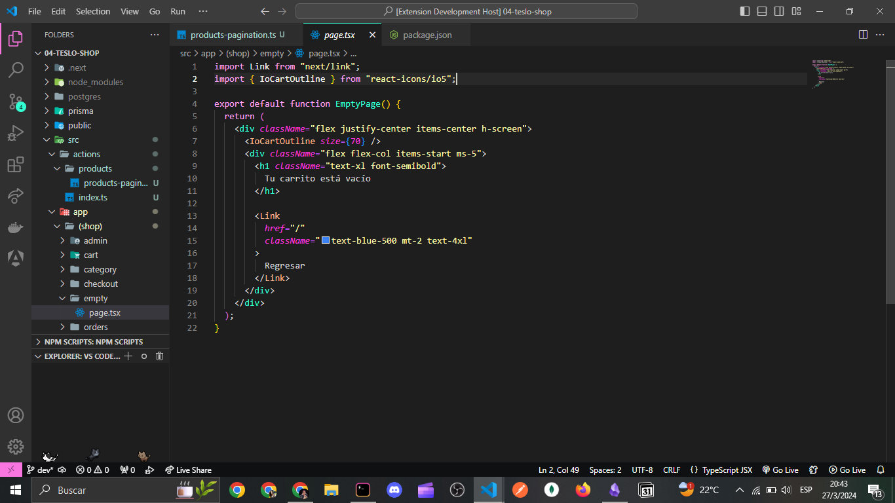

# 🦄 Unicornio Dark VSCode Theme

Here's an image of Unicornio Dark Theme in action:

## 🤩 Instalation

1. Open the extensions sidebar in VS Code.
2. Search for Unicornio Dark Theme.
3. Click install.
4. Open the Command Palette with Ctrl+Shift+P or ⇧⌘P .
5. Select Preferences: Color Theme and choose Unicornio Dark Theme.
6. **Enjoy!**

## 🐛 Bugs, suggestions and other issues

If you find a bug or have suggestions about how to make this theme better, please leave me an `Issue` in this repo 💜

## License

MIT License (For more information, check the `LICENSE` file found in the source code).

## Credits

Made with 💛 and ☕ by [Flor Luz Duarte](https://github.com/florluzduarte).

## Contributors